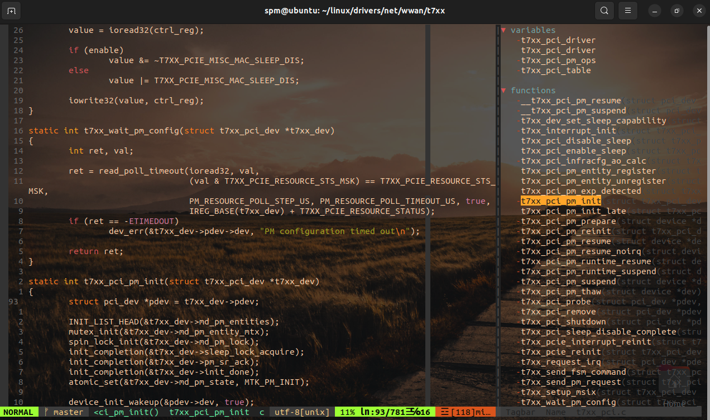

# Description
This is just a reference vimrc file which provides few modern IDE functionalities customized mostly for C programming language. It dependes upon several plugins to achieve the same. It can be further customized for other programming languages.

# Steps to configure

Please install below packages on ubuntu OS.
* sudo apt install global
* sudo apt install ctags exuberant-ctags cscope cmake gcc g++
* sudo apt install python3 python3-dev

Create below dirs.
* mkdir ~/.vim/undodir -p
* mkdir ~/.cache/tags -p

Download plug.vim
* curl -fLo ~/.vim/autoload/plug.vim --create-dirs \
    https://raw.githubusercontent.com/junegunn/vim-plug/master/plug.vim

Rename the vimrc with dot and copy .vimrc to user dir (~/).

Open vimrc and Install all plugs inside vimrc and use below command in Esc mode.
 :PlugInstall

Compile YoucompleteMe.
* cd ~/.vim/plugged/YouCompleteMe
* python3 install.py --clang-completer

Rename ycm_extra_c_cpp_conf.y with dot and copy .ycm_extra_c_cpp_conf.py to YCM dir.

# Usage

* To toggle the list of member functions and structures , you can use "Space + d"
* To jump to function definition, you can use " Space + ]"
* To move cursor among windows, you can use " Space + h/j/k/l"
* To open current directory , you can use " Space + pv"
* To resize to vertical windows, you can use " Space + v"
* To open terminal as an adjacent window, you can use " Space + t"

# Thanks!
[Primeagen](https://www.youtube.com/@ThePrimeagen) for explaining vim configuration details.
# Sample Screenshot

NB: Back ground transparency is set in the ubuntu terminal properties. It is not part of the vim configuration.
